- title : Functional.Intro
- description : Brief history of functional programming
- author : Max Grebeniuk
- theme : night
- transition : zoom

***

### Functional programming like in 1940s?

' Functional programming dates back to the 1940s. 
' back then it was rather different (minimalist)

<div class="fragment">

- Minimalist: who needs booleans?

</div>

<div class="fragment">

- A boolean just _makes a choise_!

</div>

<div class="fragment">

```fsharp
 let fun_true () = 1
 let fun_false () = 0
```

</div>

---

## Let's define a boolean 

<div class="fragment">

- A boolean just _makes a choise_!

</div>

```fsharp
 let fun_true x y = x
 let fun_false x y = y
```

<div class="fragment">

- What about defining **if..then..else** ?

</div>

<div class="fragment">

```fsharp
 let ifte pred opt_x opt_y = 
    pred opt_x opt_y
```

</div>

***

### Who needs integers?

' integers are usually used to count iterations
> Let's define integer

<div class="fragment">

' f is a loop body
```fsharp
 let twice f x = f (f x)
```

</div>

<div class="fragment">

```fsharp
 let once f x = f x
```

</div>

<div class="fragment">

```fsharp
 let zeroes f x = x
```

</div>

<div class="fragment">

' all info is in these functions
> Let's recover a _normal_ integer
```fsharp
 let two = twice ((+) 1) 0
```

</div>

---

### Mum, I can do math!

<div class="fragment">

- Adding n & m is like appying the loop body _n + m_ times

</div>

<div class="fragment">

```fsharp
 let add m n f x = m f (n f x)
```

</div>

<div class="fragment">

- Multiplication is like nesting the loops

</div>

<div class="fragment">

```fsharp
 let multiply m n f x = m (n f) x
```

</div>

--- 

### Question of the day - does it really work?

<div class="fragment">

```fsharp
 let result = add one (multiply two two) ((+) 1) 0
```

</div>

<div class="fragment">

- factorial as hello world for a type system?

</div>

<div class="fragment">

```fsharp
 let rec fact n =
    ifte (iszero n) one (multiply n (fact (decr n))) 
```

</div>

--- 

## Summary?

- Booleans, integers etc can be replaced by functions!
' why church wanted to do that? 
' functional programming could be a foundation for mathematics

<div class="fragment">

> "_Church encodings_"

 

</div>

***

### Church encodings

- Early versions of the Haskell compiler didn't have built in data structures and were using church encodings!
- Not booleans and integers ofc, but more complex data structures
' this used to be the most fast way to implement data structures
' not true any more as dynamicly created functions screw up the branch prediction


***

### Functional programming like in 1960s?

' first version of LISP

<div class="fragment">


 

John McCarthy
 
</div>

---

### LISP

' label = recursion

```lisp
 (LABEL FACT (LAMBDA (N)
    (COND ((ZEROP N) 1)
        (T (TIMES N (FACT (SUB1 N)))))))
```

<div class="fragment">

### Higher order functions

```lisp
 (MAPLIST FACT (QUOTE (1 2 3 4 5)))
```
 
</div>

<div class="fragment">

```lisp
 (1 2 6 24 120)
```
 
</div>

***

#### 1965  - The next 700 Programming Languages by Peter Landin

' 1 progr lang with 700 libraries - his progr lang 
' if u see what i mean
' lang build with laws - equivalency of two programs

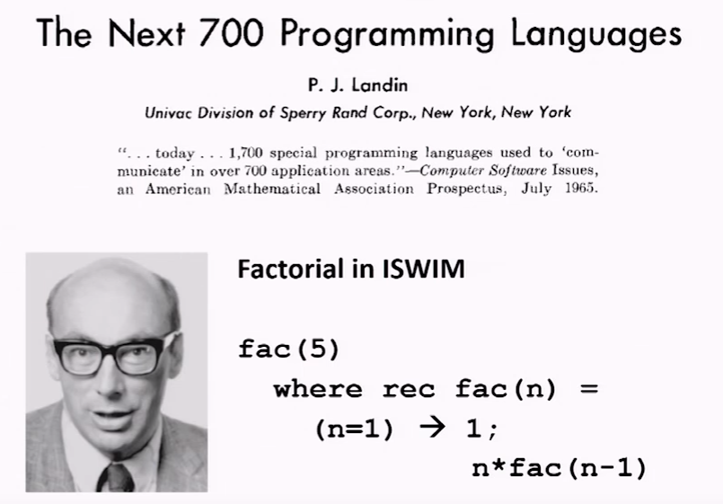 

***

### Laws

' same provided f has no side effects
' laws are there to be followed

```lisp
 (MAPLIST F (REVERSE L)) = (REVERSE (MAPLIST F L))
```

***

' BNF - backus normal form - notation for grammars
' turing award for Fortran compiler most used
' all loved to hate - full of mistakes - huge contribution
' nobody cared about programmer productivity - all care about performance
' asm for effieciency no longer can reuse bit patterns from instructions as data if they happen do be a right value
' reason of fortran success - compiler could consistently generate better asm code then human
' when giving a lecture - new love - manifesto for functional programming - impact mor then straustrup C 
' its all a mistake i should have designed erlang!
' the man who gave us fortran said - it's all wrong

[Turing award 1977 paper](http://worrydream.com/refs/Backus-CanProgrammingBeLiberated.pdf)
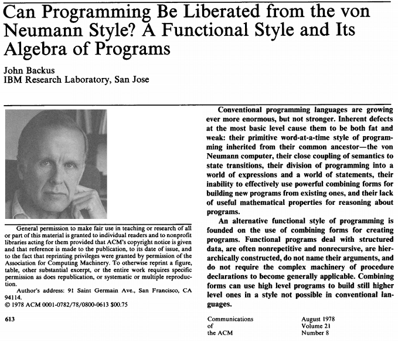 

***

#### Combining forms by Backus

' box is wrapping some functions, arrow is like data input

 

> Higher order functions

---

_Apply to all_

' this is map nowadays - select in LINQ

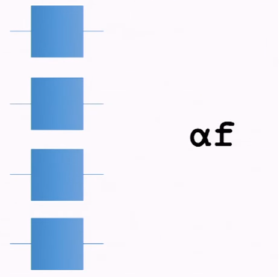 

---

_Construction_

' this is map nowadays - select in LINQ

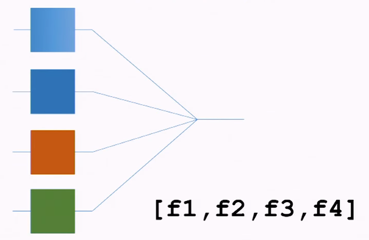 

---

> Their lack of useful mathematical properties for reasoning about programs

---

_Composition_

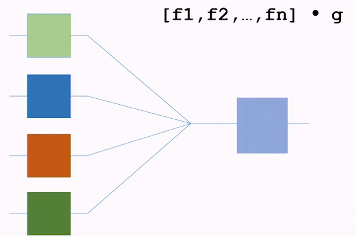 

---
_Distribution_

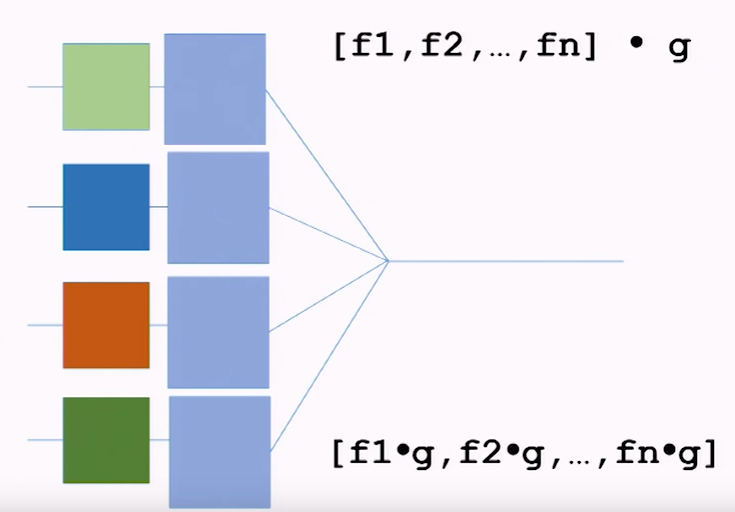 

---

_Map & construct_

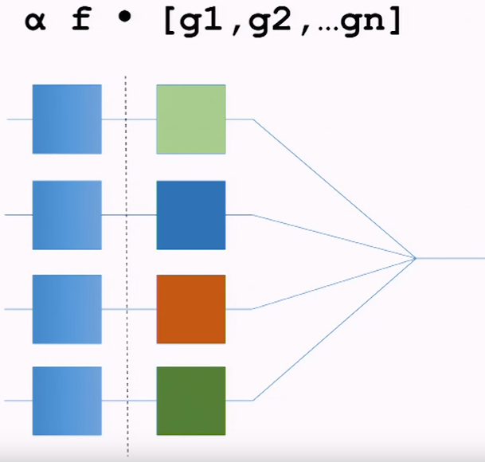 

---

_Map & construct_

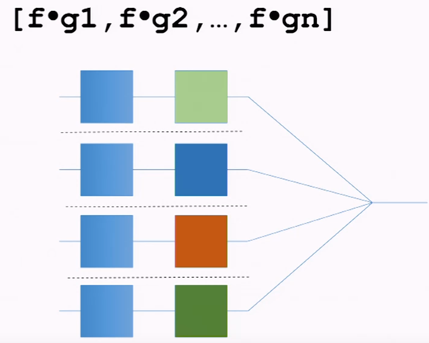 

---

_Backus Laws_

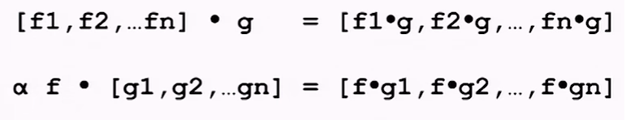 


***

### What's the difference?

' insert - fold or aggregate in LINQ

<div class="fragment">

- Fortran

```fortran
 c := 0;
 for i := 1 step 1 until n do
    c := c + a[i] * b[i]
```
 
</div>

<div class="fragment">

- FP

```FP
 Def ScalarProduct = 
    (Insert +) x (ApplyToAll *) x Transpose
```
 
</div>

***

' no money for research in field of FP
' but u could get money for prototyping in FP 
' paul - one of original haskell designers, mark to write

#### [Advanced research project agency](http://www.cs.yale.edu/publications/techreports/tr1049.pdf)

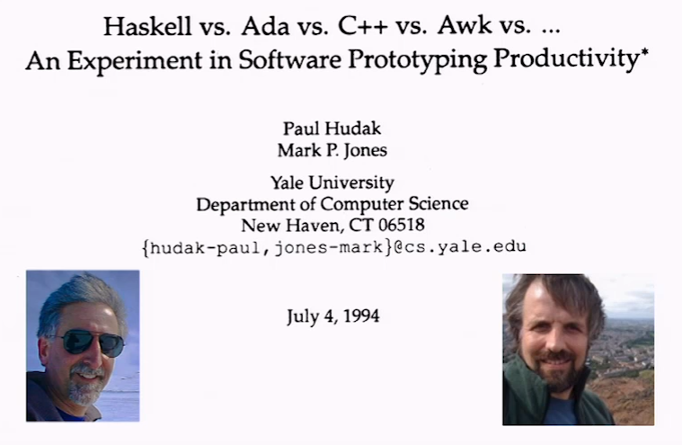 

---

#### The problem : 2D Geo-server

' geometrical server to take info about geographical position of hostile and commercial aircrafts
' divide space into regions with weird regions
' 

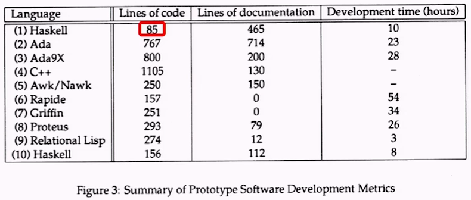 


---

#### Reaction
 
> too cute for its own good

"...higher-order functions just a trick, probably not usefyl in other contexts"

***

### Intel

```fsharp
 let result = (4195835.0 - 3145727.0 * (4195835.0 / 3145727.0)) = 0
```

<div class="fragment">

 _Buggy pentium_
 
```fsharp
 let result = (4195835.0 - 3145727.0 * (4195835.0 / 3145727.0)) = 256
```
</div>

--- 

#### This bug costed Pentium $475 million 

<div class="fragment">
 
</div>

---

#### Forte System - 1000s users

**fl** - lazy functional language - Carl Segel

- Design language
- High-level specification language
- Scripting language
- Impl for formal verification tools and theorem provers
- Object lang for theorem proving

---

#### Bluespec - FP for hardware

- Architecture spec: pure functional Haskell-like programming language
- Behaviour spec: guarded atomic transition rules - lets compiler find parallelism

> Abandon sequential von Neumann legacy

---

#### Ok, we can write Haskell like functional programs and compile them against hardware

- Which program would you compile?